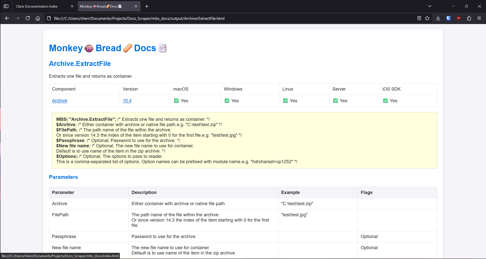

# Introduction

The goal of this project was to make essential code documentation for Claris FileMaker and the Monkeybread plugin usable while offline. Each website is scraped for relevant documentation, cleaned to be more presentable, and simplified following a basic CSS template. The project includes search functionality and complete navigation.

## Tools and Languages Used
- Python
- HTML, JavaScript, CSS
- Scrapy (web scraper)
- Jinja2
- JSON

## Challenges

- **Selective Scraping**: Initially, the scraper brought over unnecessary pages like "About," FAQs, and even outside websites.
  
- **Cleaning and Formatting**: The initial pages included too many unnecessary tabs, links, and fields (blogs, forum posts, blurbs). These were cleaned, and a template was applied to make the site more modern and user-friendly.
  
- **Index Generation**: Creating an index file that shows a Table of Contents of all pages with a search function.
  
- **Navigation**: Ensuring complete navigation between links within the docs structure. A script was built to crawl the saved HTML files, locate anchor tags, rename them based on the file name, append an "up-directory" command (`../`), and update the links using a generated JSON.
  
- **Fun Element**: Added personality to the MBS index page with an interactive monkey icon that bounces, spins, or explodes into confetti on mouseover.

## Instructions

Currently, the scripts need to be run from the terminal. Follow these steps:

### Claris
1. Navigate to the directory: `claris_docs/claris_docs`
2. Run: `scrapy crawl mbs`
3. Change to the parent directory: `cd ..`
4. Run: `python3 generate_index.py`
5. Run: `python3 clean_files.py`

### Monkeybread
1. Navigate to the directory: `mbs_docs/mbs_docs`
2. Run: `scrapy crawl mbs`
3. Run: `scrapy crawl fetch`
4. Change to the parent directory: `cd ..`
5. Run: `python3 generate_index.py`
6. Run: `python3 clean_index.py`
7. Run: `python3 generate_index.py`
8. Run: `python3 clean_files.py`
9. Run: `python3 get_anchor_text.py`
10. Run: `python3 process_anchor_text.py`
10. Run: `python3 link_mapping.py`

These instructions will populate the necessary docs to mimic a website for offline use. **WARNING**: There are over 10,000 HTML docs.

## Further Goals and Improvements

While this project solves a real-world problem, there is room for improvement:

- Create a single entry point (`main.py`) to run all necessary scripts.
- Rename directories to avoid redundancy (e.g., `docs/docs`).
- Refactor code to be more modular, adhering to DRY and SRP principles.
- Use template files for HTML styles and JavaScript to keep the code lean.
- Develop an executable so users can easily create their own offline copies.
- Add comments and testing to prevent issues like excessive document scraping.

## Lessons Learned

This was my first attempt at web scraping, and I successfully made the documentation available offline. I learned more about Python, Jinja2, and Scrapy in the process.

# Showcase

